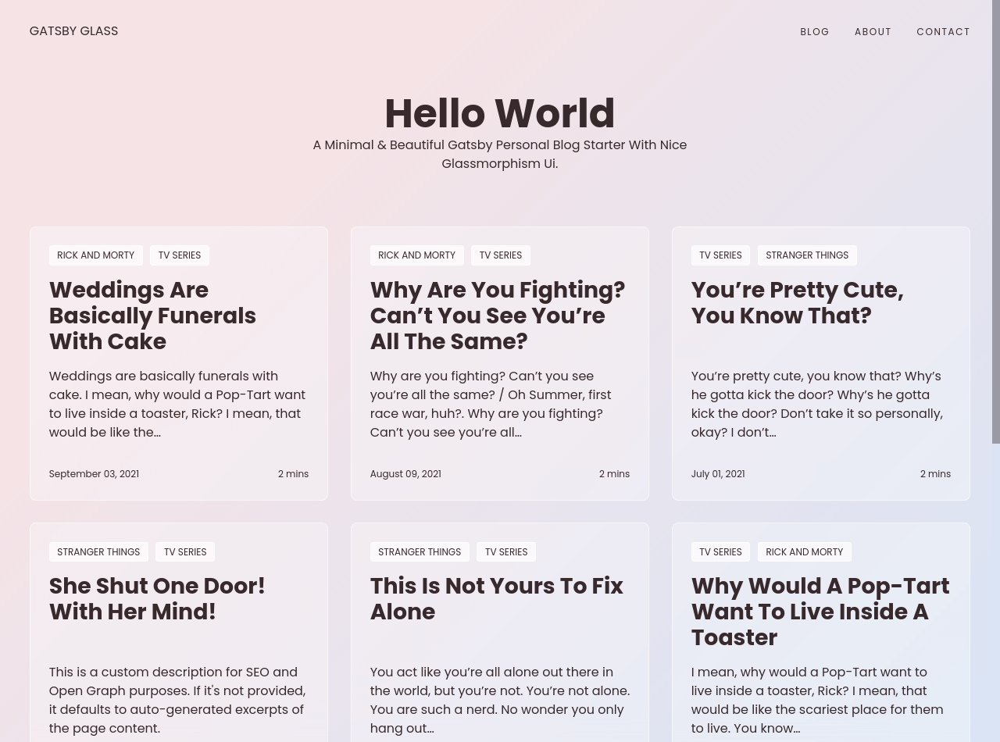

# Gatsby Starter Glass

A Minimal & Beautiful Gatsby Personal Blog Starter With Nice Glassmorphism UI.

[View Live Demo](https://gatsbyglass.netlify.app)



## Features

Fully responsive
SEO metadata and Open Graph tags
Maximize lighthouse score
Contact form with Netlify Form
Edit Content with Netlify CMS
Easy to deploy
Syntax highlighting via PrismJS

## Local Install

```bash
# 1. Clone the repository
git clone https://github.com/yinkakun/gatsby-starter-glass

# 2. Navigate into repository
cd gatsby-starter-glass

# 3. Install the dependencies
yarn install

# 4. Start the development server
yarn start

# 5. Start the build mode
yarn  build
```

## Configuration

Within gatsby-config.js, you can specify information about your site (metadata) like the site title and description to properly generate meta tags.

```js
// gatsby-config.js

module.exports = {
  siteMetadata: {
    title: `Gatsby Starter Glass`,
    author: {
      name: `Yinka Adedire`,
      summary: `self-taught front-end dev. jamstack enthusaist.`,
    },
    description: `A Minimal & Beautiful Gatsby Personal Blog Starter With Nice Glassmorphism Ui.`,
    siteUrl: `https://gatsbyglass.netlify.app`,
    social: {
      twitter: `yinkakun`,
    },
  },

  // ...
};
```

## Deployment

Netlify is a great way to easily deploy sites plus this starter uses Netlify Form for the Contact form.

- Generate a new repo from this repo which will copy all files from this repo to your newly created repo.

- Goto app.netlify.com, Once you’ve logged in, click the 'New site from Git' button on your dashboard and choose your newly created repo.

- Follow the prompts, it will build and deploy the new site on Netlify, bringing you to the site dashboard when the build is complete.

## Manually Editing contents

### Blog Posts

Blog contents can be updated in markdown format at `content/blog`. Delete placeholder posts and start blogging.

```md
---
title: Hello World
date: '2021-05-01'
description: 'Hello World'
---

This top portion is the beginning of the post and will show up as the excerpt on the homepage.
```

### Pages

Homepage intro, Contact and About page content can be updated in markdown format at `content/pages`

# Editing Contents with Netlify CMS

This project is preconfigured to work with Netlify CMS.
When Netlify CMS makes commits to your repo, Netlify will auto-trigger a rebuild / deploy when new commits are made.
You’ll need to set up Netlify’s Identity service to authorize users to log in to the CMS.

- Goto app.netlify.com > select your website from the list.
- Goto identity and Click Enable Identiy.
- Click on Invite Users and invite yourself. You will receive an email and you need to accept the invitation to set the password.
- Now headover to Settings > Identity > Services and Enable Git Gateway
- You can also manage who can register and log in to your CMS. Goto Settings > Identity > Registration >Registration Preferences. I would prefer to keep it to Invite Only, if I am the only one using it.
- Now, goto to site-name.netlify.app/admin/, and login with your credentials.

Once you are in your Netlify CMS, you can navigate to Posts and Pages. Here you will find a list of existing pages and posts.

## Built with

- Gatsby for Static Site Generation
- Netlify CMS for content management
- Styled Component for styling
